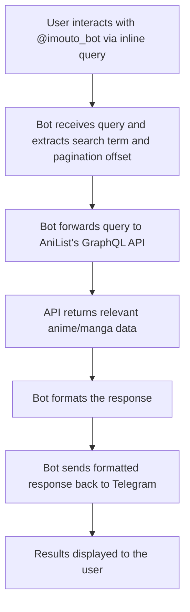

# IMOUTO_BOT


## How It Works

This bot operates as a webhook. It listens for Telegram inline queries and forwards them to an [AniList](https://anilist.co/search/anime) GraphQL [query](https://github.com/anilist/ApiV2-GraphQL-Docs). The bot processes and formats the responses to provide relevant anime/manga information back to the user.

### Workflow



1. A user interacts with the bot (@imouto_bot) via an inline query on Telegram.
2. The bot receives the query and extracts the search term and pagination offset.
3. It forwards the query to AniList's GraphQL API to fetch the relevant data.
4. The bot formats the response and sends it back to Telegram, displaying the results to the user.

### Features
- Inline query support for searching anime/manga.
- Pagination for navigating through search results.
- Hosted on Vercel for seamless deployment and scalability.

### Potential Improvements
1. **Error Handling**: Improve error handling for cases like API downtime or invalid queries.
2. **Caching**: Implement caching to reduce redundant API calls and improve response time.
3. **Unit Tests**: Add unit tests to ensure code reliability and maintainability.
4. **Rate Limiting**: Implement rate limiting to prevent abuse and ensure fair usage.

### Getting Started
To run the bot locally:
1. Clone the repository.
2. Install dependencies using `npm install`.
3. Create a `.env` file with your Telegram bot key:
   ```
   BOT_KEY=your_telegram_bot_key
   ```
4. Start the development server:
   ```
   npm start
   ```
